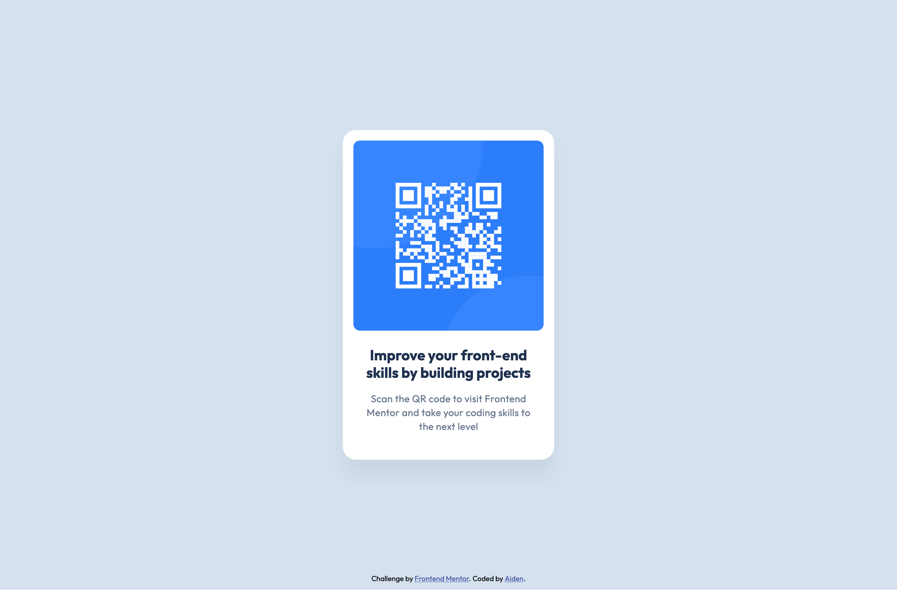

# Frontend Mentor - QR code component solution

This is a solution to the [QR code component challenge on Frontend Mentor](https://www.frontendmentor.io/challenges/qr-code-component-iux_sIO_H). Frontend Mentor challenges help you improve your coding skills by building realistic projects.

## Table of contents

- [Overview](#overview)
  - [Screenshot](#screenshot)
  - [Links](#links)
- [My process](#my-process)
  - [Built with](#built-with)
  - [What I learned](#what-i-learned)
  - [Continued development](#continued-development)
  - [Useful resources](#useful-resources)
- [Author](#author)

## Overview

### Screenshot

### Links

- Solution URL: [https://github.com/a1d3nmam3d0v/fem-qr-code-component](https://github.com/a1d3nmam3d0v/fem-qr-code-component)
- Live Site URL: [https://a1d3nmam3d0v.github.io/fem-qr-code-component/](https://a1d3nmam3d0v.github.io/fem-qr-code-component/)

## My process

### Built with

- Semantic HTML5 markup
- CSS custom properties
- Flexbox
- CSS Grid

### What I learned

A major improvement to my workflow on this project was implementing Stylelint. After customizing it with a few key plugins, my CSS properties now automatically sort themselves into a clean, consistent order on every save. As someone who loves clean code and used to rearrange every property by hand, this has been a huge timesaver.

### Continued development

For future projects, I intend to explore using a CSS or JavaScript framework. However, for this particular component, I deliberately prioritized foundational HTML and CSS, opting for a lightweight solution, as a framework would have introduced unnecessary complexity.

### Useful resources

- [Stylelint](https://stylelint.io/) - A mighty CSS linter that helps you avoid errors and enforce conventions.

## Author

- Website (WIP) - [mamedov.design](mamedov.design)
- Frontend Mentor - [@a1d3nmam3d0v](https://www.frontendmentor.io/profile/a1d3nmam3d0v)
